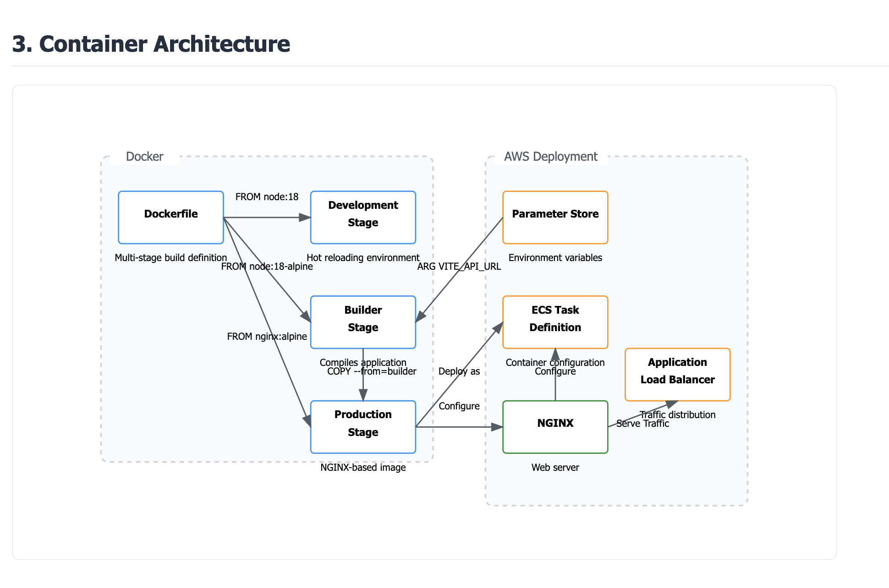

# Application Architecture Diagram Explanation

This document provides an extensive explanation of the components and interactions shown in the application architecture diagrams for the containerised AFL Talking Platform project.

---

##  Diagram 1: High-Level Application Architecture

### Components:
- **Frontend (React + Vite)**
  - Built with Vite and React.
  - Contains user interface logic, pages, routes, and API integration.
  - Built as a static app and served via NGINX in production.
  - Uses `VITE_API_URL` (injected at build time) to connect to the backend API.

- **Backend API (Placeholder)**
  - External or future backend service for handling user data, login, messaging, etc.
  - Communicates with frontend via HTTPS and CORS-enabled RESTful endpoints.
  - Assumed to be deployed independently or via another container/service.

- **NGINX Web Server**
  - Serves the production build of the React app.
  - Configured to route all unmatched paths to `index.html` (for client-side routing).
  - Lightweight and fast static file server ideal for SPAs.

- **GitHub Container Registry (GHCR)**
  - Stores production-ready Docker images.
  - Tagged with a consistent naming scheme, e.g., `ghcr.io/username/repo:prod-v1.0.3-<commit>`.

- **Client Devices**
  - End users access the app via web browsers.
  - Communicate only with the frontend, which acts as a bridge to the backend.

---

## Diagram 2: CI/CD Pipeline Architecture

### Components:
- **GitHub Repository**
  - Stores all application source code, Dockerfiles, and GitHub Actions workflows.

- **GitHub Actions**
  - Triggered on `main` branch pushes.
  - Executes a CI/CD workflow that:
    - Checks out the repo
    - Builds the Docker image using `Dockerfile`
    - Injects secrets (`VITE_API_URL`) using GitHub secrets
    - Tags image using semantic and environment-based format
    - Pushes image to GHCR

- **GitHub Secrets**
  - Stores sensitive environment values like `VITE_API_URL`, tokens, and passwords.
  - Referenced securely using `${{ secrets.VARIABLE_NAME }}`.

- **Container Registry (GHCR)**
  - Receives the production image push.
  - Can be pulled later for deployment to cloud platforms or container services.

---

## 🐳 Diagram 3: Containerization Architecture

### Components:
- **Multi-Stage Dockerfile**
  - **Stage 1 (Development)**: Installs all dependencies and runs Vite dev server.
  - **Stage 2 (Builder)**: Uses `npm run build` to compile the app.
  - **Stage 3 (Production)**: Runs NGINX with the compiled static files.
  - Efficient image layering reduces production image size and security risk.

- **Build Arguments and Environment Variables**
  - `VITE_API_URL` is passed as a build argument to ensure frontend knows which backend to call.
  - Set in both Docker and GitHub Actions using `--build-arg` and `env:`.

- **NGINX**
  - Uses a custom `nginx.conf` to correctly serve the frontend.
  - Handles routing fallback for SPAs using `try_files $uri $uri/ /index.html;`.

- **`.dockerignore`**
  - Prevents unnecessary files (e.g., `node_modules`, `.git`) from being copied into the Docker context, reducing build time and image size.

---

## Security & Secrets

### Techniques:
- All secrets (API URLs, tokens) are handled by the CI/CD platform and not hardcoded.
- `.dockerignore` avoids copying sensitive dev files.
- Docker containers run non-interactively and expose only essential ports (e.g., port 80 for NGINX).
- The final image is production-optimized with no development tooling.

---

## Summary of Interactions

| Source | Target | Protocol | Description |
|--------|--------|----------|-------------|
| Browser | NGINX (Frontend Container) | HTTPS | User requests frontend |
| Frontend | Backend API | HTTPS (with CORS) | API calls like login, get books, etc. |
| GitHub Actions | GHCR | Docker | CI builds, tags, and pushes images |
| Developer | GitHub | Git | Commits trigger automated deployments |

---

> **Note**: These diagrams and descriptions reflect a scalable, maintainable, and secure architecture designed for continuous delivery and container-based deployment of a modern frontend web application.

